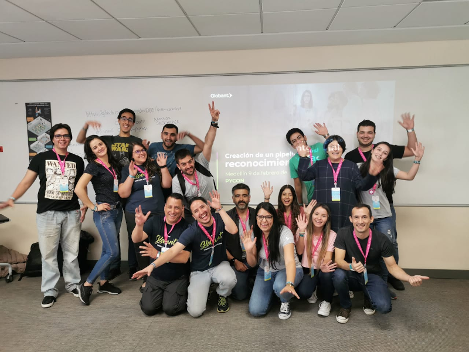

# Creación de un Pipeline de Reconocimiento Facial

Construir un pipeline de reconocimiento facial desde el registro del usuario hasta su autenticación. Considerando un modelo de machine learning hecho a la medida, con implementación on-premise y un prototipo cloud haciendo uso de los modelos disponibles en AWS / Azure.

Pycon Medellín 2020

